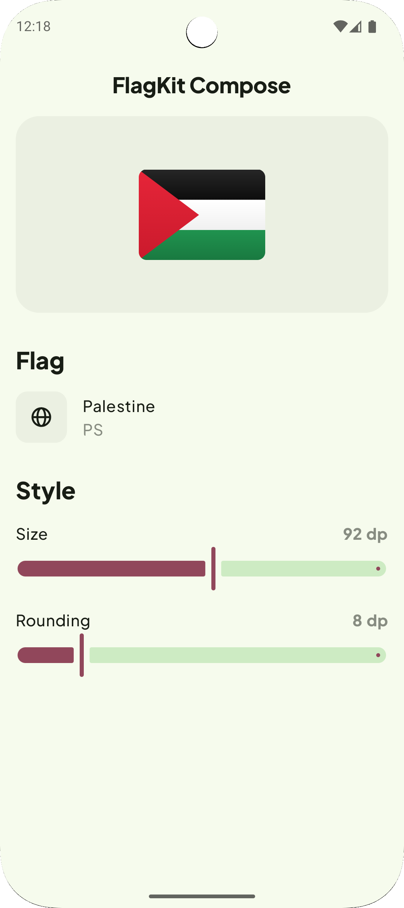
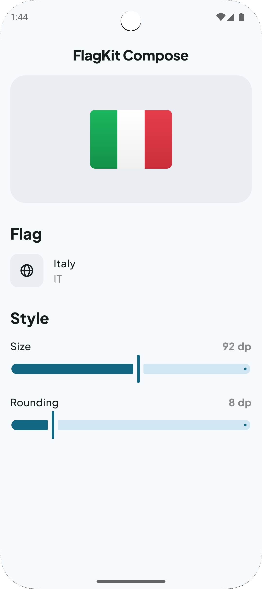
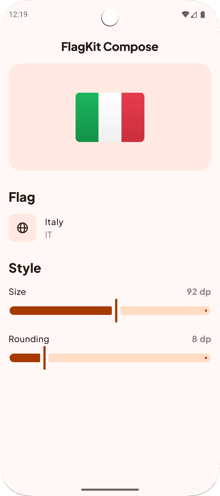
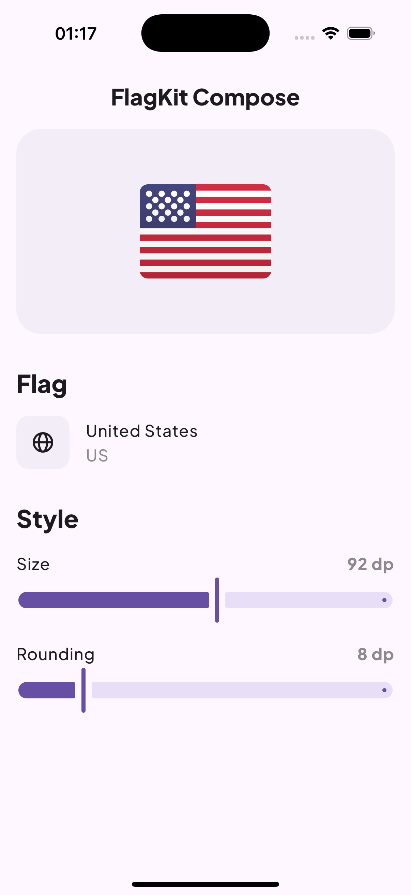

# flagkit-compose &nbsp;

Beautiful flag icons for Compose Multiplatform and Android. All flags are provided as a Kotlin Multiplatform library through Composable functions.

FlagKit Compose is a port of the original [FlagKit](https://github.com/madebybowtie/FlagKit) to Kotlin.

## 📸 Screenshots

The screenshots below show the demo app using different Material You themes on Android, and the demo app on iOS

| Android 🇵🇸                                    | Android 🇮🇹                                    | Android 🇲🇦                                     | iOS 🇺🇸                                |
|-----------------------------------------------|-----------------------------------------------|-----------------------------------------------|---------------------------------------|
|  |  |  |  |

## ⚙️ Setup  
Add FlagKit dependency to your application:

```gradle.kts
implementation("eu.acolombo.flagkit:flagkit:1.1.0")
```

If you are using version catalogs:

```toml
[versions]
flagkit = "1.1.0"
# …

[libraries]
flagkit = { group = "eu.acolombo.flagkit", name = "flagkit", version.ref = "flagkit" }
# …
```

## 🛠️ Usage
You can use the `Flag` composable with predefined flags
```kotlin
Flag(
    flag = FlagKit.Flag.PS,
    shape = RoundedCornerShape(6.dp),
    size = DpSize(56.dp, 40.dp),
)
```
Or simply with a region code string:
```kotlin
Flag(
    flag = "it",
    shape = RoundedCornerShape(6.dp),
    size = DpSize(56.dp, 40.dp),
)
```
There is also an API that closely resembles the original Swift FlagKit API, but it’s not recommended to use since the Compose API is more powerful and flexible:
```kotlin
Flag(
    countryCode = "ma",
    style = flagkit.FlagStyle.Circle,
)
```
If needed, you can access the underlying flag assets directly as `ImageVector`s:
```kotlin
Image(
    imageVector = FlagKit.Flag.MA.image,
    contentDescription = null,
)
```

## 📚 Reference

FlagKit provides over 250 flags. A list of all flags can be [found here](assets/Flags.md).

## 🤝 Contributing

This project rewrites [FlagKit](https://github.com/madebybowtie/FlagKit) for use in Kotlin Multiplatform projects.

If you want to contribute:  
– Fork and adapt the project to your needs  
– Open a Pull Request for improvements  
– Check the [issues](/../../issues) for bugs or enhancement ideas

#### Todo
- [ ] Improve demo app
- [ ] Add github preview image + header in README.md
- [ ] Add Locale Helpers
- [ ] Add Unit and UI tests

## 📄 License

FlagKit Compose is released under the MIT license. See
[LICENSE](https://github.com/acolombo11/flagkit-compose/blob/master/LICENSE).
