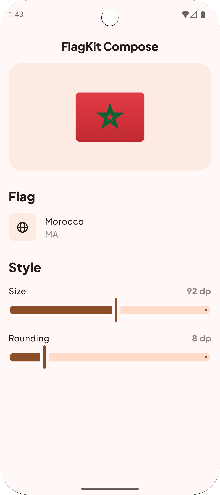

# flagkit-compose   

Beautiful flag icons for Compose Multiplatform and Android. All flags are provided as a Kotlin Multiplatform library through Composable functions.

FlagKit Compose is a port of the original [FlagKit](https://github.com/madebybowtie/FlagKit) to Kotlin.

## 📸 Screenshots

|                                               |                                               |                                               |                                           |
|-----------------------------------------------|-----------------------------------------------|-----------------------------------------------|-------------------------------------------|
|  |  |  |  |

### Setup
Add FlagKit dependency to your application:

```gradle.kts
implementation("eu.acolombo.flagkit:flagkit:1.0.0")
```

If you are using version catalogs:

```toml
[versions]
flagkit = "1.0.0"
# …

[libraries]
flagkit = { group = "eu.acolombo.flagkit", name = "flagkit", version.ref = "flagkit" }
# …
```

## Usage
 ~~FlagKit provides both rectangular unstyled flags and styled flags in a variety of shapes. Our [sample project](Sources/Swift/FlagKitDemo-iOS) demonstrates how to display flags and customize them into different shapes (rounded corners, square, circle).~~

 ~~This brief example loads the flag for the users current locale, and retrieves the unstyled flag and a styled flag:~~

```swift
let countryCode = Locale.current.regionCode!
let flag = Flag(countryCode: countryCode)!

// Retrieve the unstyled image for customized use
let originalImage = flag.originalImage

// Or retrieve a styled flag
let styledImage = flag.image(style: .circle)
```

 ~~You can always access the underlying assets directly, through the bundled Asset Catalog:~~

```swift
let countryCode = Locale.current.regionCode!
let bundle = FlagKit.assetBundle
let originalImage = UIImage(named: countryCode, in: bundle, compatibleWith: nil)
```

## Todo

- [ ] Update the Usage, info above is not valid
- [ ] Cleanup demo app
- [ ] Add Unit and UI tests
- [ ] Check Previews

## Reference

FlagKit provides over 250 flags. A list of all flags can be [found here](assets/Flags.md).

## License

FlagKit Compose is released under the MIT license. See
[LICENSE](https://github.com/acolombo11/flagkit-compose/blob/master/LICENSE).
